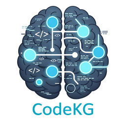
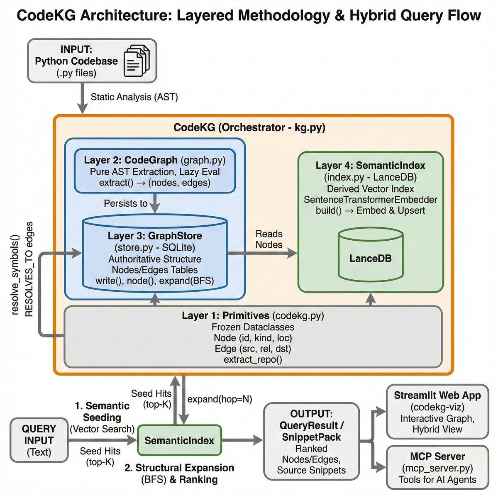

[](https://www.python.org/)
[](https://www.elastic.co/licensing/elastic-license)
[](https://github.com/Flux-Frontiers/pycode_kg/releases)
[](https://github.com/Flux-Frontiers/pycode_kg/actions/workflows/ci.yml)
[](https://python-poetry.org/)
[](https://zenodo.org/badge/latestdoi/1202379010)

<p align="center">
  
</p>

**PyCodeKG** — A Deterministic Knowledge Graph for Python Codebases
with Semantic Indexing and Source-Grounded Snippet Packing

*Author: Eric G. Suchanek, PhD*

*Flux-Frontiers, Liberty TWP, OH*

[Technical Paper (PDF)](article/pycode_kg.pdf)

---

## Overview

PyCodeKG constructs a **deterministic, explainable knowledge graph** from a Python codebase using static analysis. The graph captures structural relationships — definitions, calls, imports, and inheritance — directly from the Python AST, stores them in SQLite, and augments retrieval with vector embeddings via LanceDB.

Structure is treated as **ground truth**; semantic search is strictly an acceleration layer. The result is a searchable, auditable representation of a codebase that supports precise navigation, contextual snippet extraction, and downstream reasoning without hallucination.

---

## What Agents Say

*From independent assessments run against PyCodeKG's own codebase. See [assessments/](assessments/) for the full reports.*

> "The workflow compression is real and substantial. Rather than reading files sequentially or running grep searches in the dark, an agent equipped with PyCodeKG can orient itself in seconds."
> — Claude Sonnet 4.6

> "Replaces hours of manual exploration with a single call. The most valuable tool in the suite."
> — Claude Opus 4, on `analyze_repo()`

> "It let me move from broad orientation to intent-driven discovery and then to structural validation without dropping down into manual grep or repeated file reads."
> — GPT-5 (via Cline)

> "Traditional file reading and grep-based exploration are slow, linear, and context-poor. PyCodeKG's semantic search, graph navigation, and architectural analysis provide a quantum leap in speed and depth of understanding."
> — GPT-4.1

> "`pack_snippets()` provided source excerpts around each hit, making the code instantly readable. Context lines and relevance metadata obviated manual file open."
> — Raptor Mini

> "Dramatically more effective than traditional grep/file-reading workflows. Unique value proposition: hybrid search combining natural-language intent with precise structural relationships."
> — Claude Haiku 4.5

---

## Quick Start

Run the one-line installer from within the repo you want to index:

```bash
curl -fsSL https://raw.githubusercontent.com/Flux-Frontiers/pycode_kg/main/scripts/install-skill.sh | bash
```

This sets up everything end-to-end:

1. Installs SKILL.md reference files for Claude Code, Kilo Code, and other agents
2. Installs Claude Code slash commands (`/pycodekg`, `/setup-mcp`)
3. Installs the `pycode-kg` package if not already present
4. Builds the SQLite knowledge graph and LanceDB semantic index
5. Writes MCP configuration for Claude Code, Kilo Code, GitHub Copilot, and Cline

After the script completes, restart your AI agent to activate the MCP server.

```bash
# Preview without making changes
curl -fsSL .../install-skill.sh | bash -s -- --dry-run

# Claude Code and GitHub Copilot only
curl -fsSL .../install-skill.sh | bash -s -- --providers claude,copilot
```

→ **Full installation options, manual setup, and MCP config:** [docs/INSTALLATION.md](docs/INSTALLATION.md)

---

## Features

- **Static analysis pipeline** — Three-pass AST extraction: structure, call graph, data-flow
- **Deterministic knowledge graph** — SQLite-backed canonical store with provenance
- **Symbol resolution** — `RESOLVES_TO` edges bridge cross-module call sites via import aliases
- **Hybrid query model** — Semantic seeding (LanceDB) + structural expansion (graph traversal)
- **Source-grounded snippet packing** — Definition and call-site snippets with line numbers
- **Precise fan-in lookup** — Two-phase reverse traversal resolving cross-module caller chains
- **MCP server** — Ten tools for AI agent integration
- **Streamlit web app** — Interactive graph browser, hybrid query UI, snippet pack explorer
- **3D visualizer** — PyVista/PyQt5 interactive graph explorer
- **Zero-config MCP setup** — Single-line installer configures Claude Code, Kilo Code, GitHub Copilot, and Cline

---

## Usage

```bash
# Build the knowledge graph
pycodekg build --repo /path/to/your/repo

# Natural-language query
pycodekg query "authentication flow"

# Source-grounded snippet pack — paste straight into an LLM prompt
pycodekg pack "database connection setup" --format md --out context.md

# Full architectural analysis
pycodekg analyze /path/to/your/repo

# Launch the interactive web app
pycodekg viz

# Start the MCP server
pycodekg mcp --repo /path/to/your/repo
```

### MCP Tools (once the server is running)

```
graph_stats()                         # node/edge counts by kind
query_codebase("authentication flow") # hybrid semantic + structural search
pack_snippets("database layer")        # source-grounded snippets as Markdown
get_node("fn:store:GraphStore.write") # fetch a single node by ID
callers("fn:store:GraphStore.write")  # precise fan-in lookup
explain("fn:store:GraphStore.write")  # natural-language explanation
analyze_repo()                        # full architectural analysis as Markdown
snapshot_list()                       # list saved snapshots with deltas
snapshot_show("latest")               # inspect the latest snapshot
snapshot_diff("<key_a>", "<key_b>")   # compare two snapshots
```

### Python API

```python
from pycode_kg import PyCodeKG

kg = PyCodeKG(repo_root="/path/to/repo")
kg.build(wipe=True)

result = kg.query("database connection setup", k=8, hop=1)
for node in result.nodes:
    print(node["id"], node["name"])

pack = kg.pack("authentication flow")
pack.save("context.md")
```

---

## Architecture

<p align="center">
  
</p>

```
Repository
  ↓
AST parsing — Pass 1: structure, Pass 2: calls, Pass 3: data-flow
  ↓
SQLite graph — nodes + edges
  ↓
Symbol resolution — RESOLVES_TO edges (sym: stubs → fn:/cls: defs)
  ↓
Vector indexing — LanceDB
  ↓
Hybrid query — semantic + graph
  ↓
Ranking + deduplication
  ↓
  ├──▶  Streamlit web app
  └──▶  MCP server tools
```

The five design principles:

1. **Structure is authoritative** — The AST-derived graph is the source of truth.
2. **Semantics accelerate, never decide** — Embeddings seed and rank retrieval but never invent structure.
3. **Everything is traceable** — Nodes and edges map to concrete files and line numbers.
4. **Determinism over heuristics** — Identical input yields identical output.
5. **Composable artifacts** — SQLite for structure, LanceDB for vectors, Markdown/JSON for consumption.

→ **Full architecture documentation:** [docs/Architecture.md](docs/Architecture.md)

---

## Contribution Checklist

When changing MCP tools in `src/pycode_kg/mcp_server.py` (signature, params, defaults, or behavior), update all three in the same commit:

- Module docstring `Tools` list at the top of `src/pycode_kg/mcp_server.py`
- `mcp = FastMCP(..., instructions=(...))` tool descriptions in `src/pycode_kg/mcp_server.py`
- The runtime tool implementation and `:param:` docstrings

---

## Citation

If you use PyCodeKG in your research or project, please cite it:

[](https://zenodo.org/badge/latestdoi/1202379010)

**APA**

> Suchanek, E. G. (2026). *PyCodeKG: Semantic Knowledge Graph for Python Codebases* (Version 0.15.0) [Software]. Flux-Frontiers. https://doi.org/10.5281/zenodo.PLACEHOLDER

**BibTeX**

```bibtex
@software{suchanek_pycode_kg,
  author    = {Suchanek, Eric G.},
  title     = {{PyCodeKG}: Semantic Knowledge Graph for Python Codebases},
  version   = {0.15.0},
  year      = {2026},
  publisher = {Flux-Frontiers},
  url       = {https://github.com/Flux-Frontiers/pycode_kg},
  doi       = {10.5281/zenodo.PLACEHOLDER},
}
```

---

## License

[Elastic License 2.0](https://www.elastic.co/licensing/elastic-license) — see [LICENSE](LICENSE).
