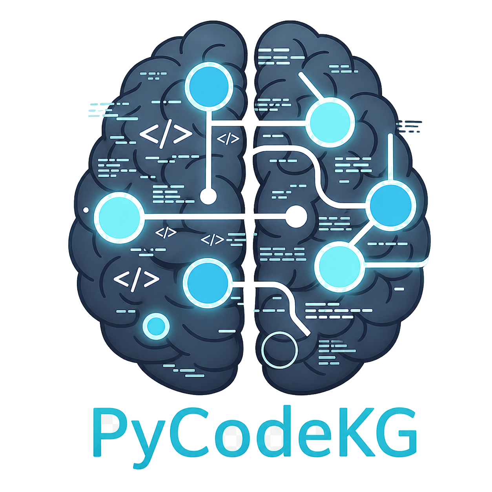

<p align="center">
  
</p>

[](https://www.python.org/)
[](https://www.elastic.co/licensing/elastic-license)
[](https://github.com/Flux-Frontiers/pycode_kg/releases)
[](https://github.com/Flux-Frontiers/pycode_kg/actions/workflows/ci.yml)
[](https://python-poetry.org/)
[](https://zenodo.org/badge/latestdoi/1202379010)

**PyCodeKG** — A Deterministic Knowledge Graph for Python Codebases
with Semantic Indexing and Source-Grounded Snippet Packing

*Author: Eric G. Suchanek, PhD*
*Flux-Frontiers, Liberty TWP, OH*

[Technical Paper (PDF)](article/pycode_kg.pdf)

---

## Overview

PyCodeKG constructs a **deterministic, explainable knowledge graph** from a Python codebase using static analysis. The graph captures structural relationships — definitions, calls, imports, and inheritance — directly from the Python AST, stores them in SQLite, and augments retrieval with vector embeddings via LanceDB.

**No inference required.** The CLI is fully useful as a standalone analysis tool — every result is derived from structure, not generated. When used with AI agents, PyCodeKG gives them structurally-grounded answers: precise callers, real call chains, exact line numbers. Hallucination-resistant by design.

Structure is treated as **ground truth**; semantic search is strictly an acceleration layer. The result is a searchable, auditable representation of a codebase that supports precise navigation, contextual snippet extraction, and downstream reasoning without hallucination.

PyCodeKG uses the same architecture as [DocKG](https://github.com/Flux-Frontiers/doc_kg) but targets Python source code rather than document corpora.

---

## Features

- **Static analysis pipeline** — Three-pass AST extraction: structure, call graph, data-flow
- **Deterministic knowledge graph** — SQLite-backed canonical store with provenance-tracked edges
- **Symbol resolution** — `RESOLVES_TO` edges bridge cross-module call sites via import aliases
- **Hybrid query model** — Semantic seeding (LanceDB embeddings) + structural expansion (graph traversal)
- **Source-grounded snippet packing** — Definition and call-site snippets with line numbers
- **Precise fan-in lookup** — Two-phase reverse traversal resolving cross-module caller chains
- **Temporal snapshots** — Save and diff graph metrics across commits and versions
- **MCP server** — Seventeen tools for AI agent integration
- **Streamlit web app** — Interactive graph browser, hybrid query UI, snippet pack explorer
- **3-D visualizer** — PyVista/PyQt5 interactive graph explorer with FunnelLayout and timeline view
- **Zero-config MCP setup** — Single-line installer configures Claude Code, Kilo Code, GitHub Copilot, and Cline

---

## Quick Start

```bash
# Index your repo (SQLite + LanceDB in one step)
pycodekg build --repo /path/to/repo

# Natural-language query
pycodekg query "authentication flow"

# Source-grounded snippet pack — paste straight into an LLM prompt
pycodekg pack "database connection setup" --format md --out context.md

# Full architectural analysis
pycodekg analyze /path/to/repo
```

---

## Installation

**Requirements:** Python ≥ 3.12, < 3.14

```bash
# pip
pip install pycode-kg

# With Streamlit web visualizer
pip install 'pycode-kg[viz]'

# With 3-D visualizer (PyVista/PyQt5)
pip install 'pycode-kg[viz3d]'

# Poetry
poetry add pycode-kg
```

> For the one-line skill installer (MCP config, Claude slash commands, git hooks) see [docs/INSTALLATION.md](docs/INSTALLATION.md).

---

## Usage

### Build and query

```bash
pycodekg build --repo .                              # full build (SQLite + LanceDB)
pycodekg build --repo . --include-dir src            # index a specific subtree
pycodekg query "snapshot freshness comparison"       # hybrid semantic + structural search
pycodekg pack "graph build pipeline" --format md     # snippet pack for LLM context
```

### Analyze codebase health

```bash
pycodekg analyze .                                   # full report + JSON snapshot
```

### Snapshots

```bash
pycodekg snapshot save 0.18.0                        # capture current metrics
pycodekg snapshot list                               # list all snapshots
pycodekg snapshot diff <key_a> <key_b>               # compare two versions
```

### Visualize

```bash
pycodekg viz                                         # Streamlit web app
pycodekg viz3d --layout funnel                       # 3-D PyVista explorer
pycodekg viz-timeline                                # metric history timeline
```

> Full flag reference: [docs/INSTALLATION.md](docs/INSTALLATION.md) · Query patterns: [docs/CHEATSHEET.md](docs/CHEATSHEET.md)

---

## MCP Integration

Start the MCP server, then wire it into your AI agent:

```bash
pycodekg mcp --repo /path/to/repo
```

PyCodeKG exposes seventeen tools covering hybrid search, snippet packing, caller tracing, architectural analysis, and temporal snapshots. Any MCP-compatible agent — Claude Code, Claude Desktop, Cursor, Continue, GitHub Copilot — can consume them directly.

> Full provider setup, tool reference, and SSE transport: [docs/MCP.md](docs/MCP.md)

---

## What Agents Say

*From independent assessments run against PyCodeKG's own codebase. See [assessments/](assessments/) for full reports.*

> "PyCodeKG compresses a multi-step workflow — semantic search, graph expansion, caller tracing, snippet retrieval, and architectural summarization — into a small set of tools that are fast to invoke and easy to chain. In practice, it let me move from broad orientation to intent-driven discovery and then to structural validation without dropping down into manual grep or repeated file reads."
> — GPT-5 (via Cline)

> "What sets it apart from 'search the repo with embeddings' tools is the structural layer… Verdict: 4.5/5 — recommend without reservation for any non-trivial Python codebase."
> — Claude Opus 4.7

> "PyCodeKG is dramatically more effective than traditional grep/file-reading workflows. Unique value: hybrid search combining natural-language intent with precise structural relationships."
> — Claude Haiku 4.5

> "`pack_snippets()` provided source excerpts around each hit, making the code instantly readable. Context lines and relevance metadata obviated manual file open."
> — Raptor Mini

---

## Citation

If you use PyCodeKG in your research or project, please cite it:

[](https://zenodo.org/badge/latestdoi/1202379010)

**APA**

> Suchanek, E. G. (2026). *PyCodeKG: Semantic Knowledge Graph for Python Codebases* (Version 0.18.0) [Software]. Flux-Frontiers. https://doi.org/10.5281/zenodo.19834777

**BibTeX**

```bibtex
@software{suchanek_pycode_kg,
  author    = {Suchanek, Eric G.},
  title     = {{PyCodeKG}: Semantic Knowledge Graph for Python Codebases},
  version   = {0.18.0},
  year      = {2026},
  publisher = {Flux-Frontiers},
  url       = {https://github.com/Flux-Frontiers/pycode_kg},
  doi       = {10.5281/zenodo.19834777},
}
```

---

## License

[Elastic License 2.0](https://www.elastic.co/licensing/elastic-license) — free for non-commercial and internal use; commercial redistribution or hosting requires a license from Flux-Frontiers.
