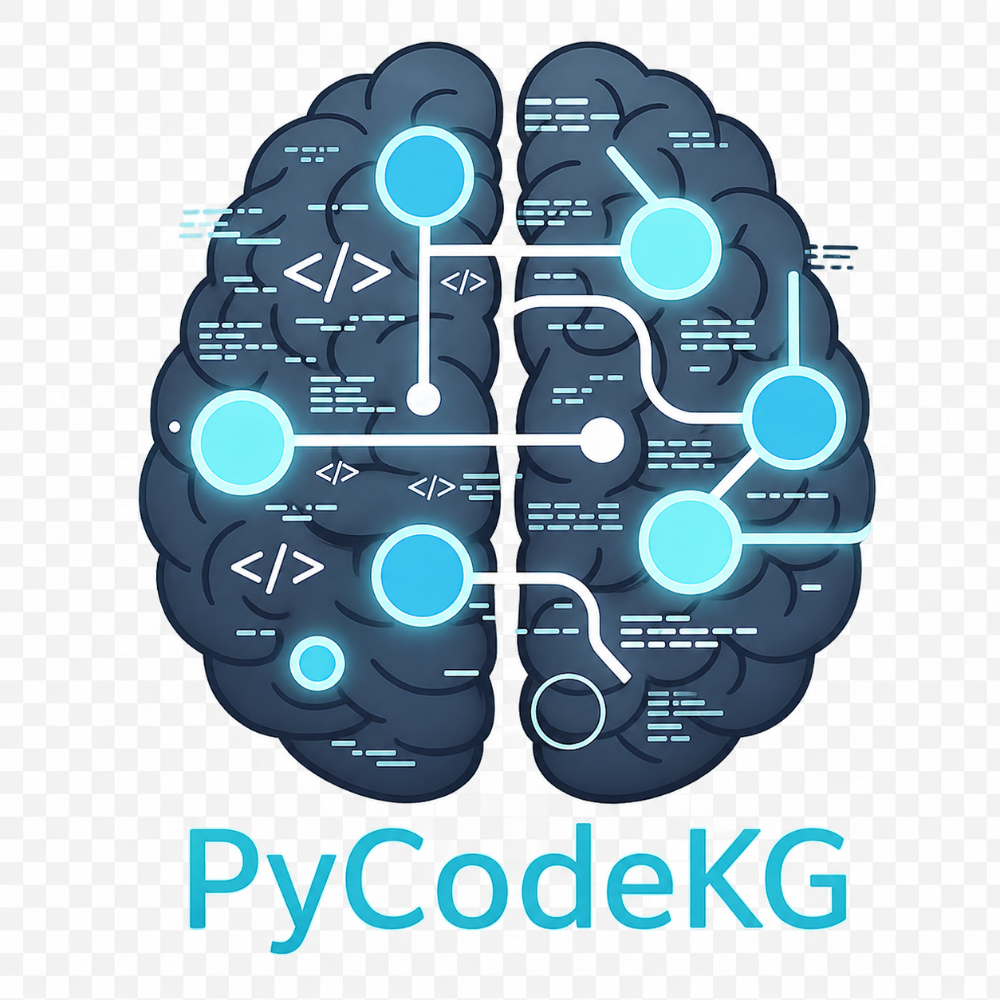

<p align="center">
  
</p>

[](https://www.python.org/)
[](https://www.elastic.co/licensing/elastic-license)
[](https://github.com/Flux-Frontiers/pycode_kg/releases)
[](https://github.com/Flux-Frontiers/pycode_kg/actions/workflows/ci.yml)
[](https://python-poetry.org/)
[](https://zenodo.org/badge/latestdoi/1202379010)

# PyCodeKG — A Knowledge Graph for Python Codebases

**PyCodeKG turns a Python codebase into a deterministic, queryable knowledge graph — and uses it to produce architectural analyses you can act on, with or without an LLM in the loop.**

It walks the AST of every module, class, function, and method in your repo, extracts the typed relationships that actually hold the code together (`CONTAINS`, `CALLS`, `IMPORTS`, `INHERITS`, `RESOLVES_TO`), and stores the result in SQLite. A LanceDB vector index sits alongside the graph so that *"authentication flow"* and *"verify_jwt"* both find the right place to start exploring. From there you can rank functions by structural importance, trace fan-in across import aliases, detect circular imports and dead code, render the call graph in 3D, snapshot metrics for diffing across releases, or hand the whole thing to Claude over MCP.

The original motivation was simple: **produce thorough, defensible analyses of Python codebases that don't depend on inference**. Every result is computed from the AST and the graph — no model is asked to guess. When an LLM is present, it consumes the *same* grounded output as a structured context pack, and the hallucinations that plague "embed-the-repo" tools largely disappear.

Everything runs on your laptop. No cloud APIs, no quotas, no source code leaving the machine.

[Technical Paper (PDF)](article/pycode_kg.pdf) · *Author: Eric G. Suchanek, PhD — Flux-Frontiers, Liberty TWP, OH*

---

## Sister projects

PyCodeKG is part of a growing family of knowledge-graph systems that share the same hybrid semantic-plus-structural design — each one applies it to a different kind of corpus:

- **[DocKG](https://github.com/Flux-Frontiers/doc_kg)** — Markdown and prose. Indexes PyCodeKG's own documentation, so the docs you're reading are themselves a queryable graph.
- **[MetaboKG](https://github.com/Flux-Frontiers/metabo_kg)** — metabolic pathway data (KEGG, SBML, BioPAX), with FBA / ODE simulation on top of the graph.
- **[DiaryKG](https://github.com/Flux-Frontiers/diary_kg)** — personal journals and diary corpora; semantic search and graph traversal over a writer's body of work.
- **[FTreeKG](https://github.com/Flux-Frontiers/FTreeKG)** — filesystem trees as a queryable graph of directories, files, and contents.
- **[AgentKG](https://github.com/Flux-Frontiers/agent_kg)** — conversational memory as a knowledge graph: turns, decisions, commitments, preferences, and the relationships between them.

Together they form **KGRAG**, a federated retrieval layer where one query can span code, documentation, journals, filesystems, agent memory, and domain data simultaneously.

---

## Two ways to use it

PyCodeKG is designed to be useful at both ends — as a standalone command-line analysis tool, and as a structured context layer for AI agents.

### 1. Standalone — `pycodekg analyze`

This single command is the actual reason I wrote this module. I got tired of my LLM doing grep on my src/ in order to get a good analysis of the codebase. This command runs fifteen analysis passes in seconds and the output drops straight into your favorite coding LLM for targeted improvement suggestions. I used this process to iteratively improve PyCodeKG and several of the analysis passes were added as a result.

The analysis/ has files *_analysis_<date>.md - I ran PyCodeKG against **numpy** and **matplotlib** for fun.

```bash
pycodekg init                                        # downloads embedder
pycodekg build --repo .                              # one-time index
pycodekg analyze.                                    # the full report
```

**Note**
The first-time run can take some time to warm up. Be patient.

The 15-phase pipeline runs in sequence and surfaces several important metrics:

| # | Phase | What it surfaces |
|---|-------|-----------------|
| 1 | Baseline metrics | Node/edge counts, graph shape |
| 2 | CodeRank (global PageRank) | Structurally most important symbols |
| 3 | Fan-in analysis | Heavily depended-on functions (breaking-change risk) |
| 4 | Fan-out analysis | Orchestrators and complexity hotspots |
| 5 | Dependency analysis | Orphaned / dead code candidates |
| 6 | Pattern detection | Anti-patterns and structural red flags |
| 7 | Module coupling | Tightly coupled pairs, import graph density |
| 8 | Critical paths | Longest call chains, bottlenecks |
| 9 | Public API identification | Exposed vs. internal surface |
| 10 | Docstring coverage | By module, class, function, method |
| 11 | Inheritance hierarchy | Depth, multiple inheritance, diamond patterns |
| 12 | Insight synthesis | Issues + strengths callouts |
| 13 | Snapshot history | Metric trends across releases |
| 14 | Structural centrality (SIR) | Bridge nodes, graph removal impact |
| 15 | Concern-based ranking | Nodes grouped by architectural concern |

Every finding maps to a file and line number — no hallucinated signatures, no probabilistic guesses. The Markdown output is LLM-ready; the JSON snapshot is CI-gate-ready. Reach for `analyze` before any non-trivial refactor, at every release, and whenever you inherit an unfamiliar codebase. Full reference: [docs/Analyze.md](docs/Analyze.md).

```bash
pycodekg analyze --quiet --json ~/.claude/pycodekg_analysis_latest.json
jq '.docstring_coverage.total' ~/.claude/pycodekg_analysis_latest.json
```

### 2. Agentic — MCP server for grounded AI workflows

Run `pycodekg mcp` and Claude (or any MCP-aware client) gets nineteen tools backed by the same graph: `graph_stats`, `query_codebase`, `pack_snippets`, `get_node`, `list_nodes`, `callers`, `explain`, `centrality`, `bridge_centrality`, `framework_nodes`, `analyze_repo`, `snapshot_list / show / diff`, and more. Setup for Claude Code, Claude Desktop, Kilo Code, Copilot, and Cline is a single line — see [docs/MCP.md](docs/MCP.md) and [docs/INSTALLATION.md](docs/INSTALLATION.md).

The agent benefit isn't subtle. Tools like `pack_snippets` return *actual source* with line numbers and surrounding context; `callers` returns the *real* fan-in resolved across import aliases, not a regex's best guess. The agent stops fabricating function signatures and starts citing them. Multi-step workflows — *"find the auth path, list its callers, summarize what changes if I rename it"* — collapse from dozens of `grep`s and file reads into a handful of source-grounded calls.

Independent assessments tend to put it the same way:

> "PyCodeKG compresses a multi-step workflow — semantic search, graph expansion, caller tracing, snippet retrieval, and architectural summarization — into a small set of tools that are fast to invoke and easy to chain. In practice, it let me move from broad orientation to intent-driven discovery and then to structural validation without dropping down into manual grep or repeated file reads."
> — *GPT-5 (via Cline)*

> "What sets it apart from 'search the repo with embeddings' tools is the structural layer… Verdict: 4.5/5 — recommend without reservation for any non-trivial Python codebase."
> — *Claude Opus 4.7*

> "PyCodeKG is dramatically more effective than traditional grep/file-reading workflows. Unique value: hybrid search combining natural-language intent with precise structural relationships."
> — *Claude Haiku 4.5*

Full reports in [assessments/](assessments/).

---

## Get started in 60 seconds

**Requirements:** Python ≥ 3.12, < 3.14

```bash
pip install 'pycode-kg[viz,viz3d]'        # base + Streamlit + 3-D viewer

cd /path/to/your/repo
pycodekg init --repo .                    # download model, build graph, install hooks, snapshot
pycodekg analyze .                        # the architectural report
```

That's the recommended path. Variants (minimal install, MCP-only, contributor setup) are in [docs/INSTALLATION.md](docs/INSTALLATION.md). Every CLI subcommand is also exposed as a script alias (`pycodekg-analyze`, `pycodekg-build`, `pycodekg-mcp`, …) for use in Makefiles and Poetry projects.

---

## How retrieval works

Search is hybrid by design. A query like *"authentication flow"* runs in two phases:

1. **Vector phase** — the query is embedded with a local sentence-transformer (cached after first download) and LanceDB returns the `k` closest functions, classes, and modules by cosine similarity.
2. **Graph expansion phase** — each seed hit is expanded `hop` BFS steps along the typed edges (`CONTAINS`, `CALLS`, `IMPORTS`, `INHERITS`, `RESOLVES_TO`) so call chains and module relationships surface alongside the names that matched.

**Structure is treated as ground truth; the embeddings are strictly an acceleration layer.** When the graph and the vector index disagree, the graph wins. This is why fan-in lookups are accurate even for same-named symbols across modules — `RESOLVES_TO` edges bridge call sites through their import aliases, and `callers()` does a two-phase reverse traversal that grep simply cannot replicate.

The graph is built around four node kinds (module, class, function, method) and five edge relations. Schema and edge semantics are documented in [docs/CHEATSHEET.md](docs/CHEATSHEET.md).

---

## What you can do with it

| If you want to… | Reach for | Detail |
|---|---|---|
| **Get a thorough architectural report** | `pycodekg analyze` | [docs/Analyze.md](docs/Analyze.md) |
| **Generate a coherent architecture description** | `pycodekg architecture` | [docs/Architecture_usage.md](docs/Architecture_usage.md) |
| **Track metrics across releases** | `pycodekg snapshot save / list / diff` | [docs/SNAPSHOTS.md](docs/SNAPSHOTS.md) |
| **Identify the most structurally important code** | `pycodekg centrality` (SIR PageRank) | [docs/CODERANK.md](docs/CODERANK.md) |
| **Pull source-grounded context for an LLM** | `pycodekg pack "..." --format md` | [docs/CHEATSHEET.md](docs/CHEATSHEET.md) |
| **Run a hybrid semantic + structural query** | `pycodekg query "..."` | [docs/CHEATSHEET.md](docs/CHEATSHEET.md) |
| **Browse the graph interactively** | `pycodekg viz` (Streamlit) | [docs/INSTALLATION.md](docs/INSTALLATION.md) |
| **See call graphs in 3-D** *(active development — functional but rough)* | `pycodekg viz3d --layout funnel` | [docs/VIZ3D.md](docs/VIZ3D.md) |
| **Wire it into Claude / Copilot / Cline** | `pycodekg mcp` | [docs/MCP.md](docs/MCP.md) |

If you only read one doc after this one, read [docs/Analyze.md](docs/Analyze.md) — that's where most of the day-to-day value lives.

---

## Architecture

```
src/pycode_kg/
├── visitor.py                       # AST extraction (three-pass: structure, calls, dataflow)
├── graph.py                         # GraphBuilder: file discovery + dispatch
├── store.py                         # SQLite persistence + canonical edges
├── index.py                         # LanceDB semantic index
├── pycodekg.py                      # Public façade
├── pycodekg_query.py                # Hybrid query
├── pycodekg_snippet_packer.py       # Source-grounded packs
├── pycodekg_thorough_analysis.py    # `analyze` engine
├── architecture.py                  # `architecture` description generator
├── ranking/                         # PageRank, bridge centrality, framework nodes
├── snapshots.py                     # Temporal metric snapshots
├── analysis/                        # Coupling, cycles, orphans, hotspots
├── cli/                             # All `pycodekg-*` entry points
├── mcp_server.py                    # MCP server (nineteen tools)
├── app.py                           # Streamlit web app
├── viz3d.py / layout3d.py           # PyVista/PyQt5 3-D viewer
└── viz3d_timeline.py                # Metric history timeline
```

The MCP server, the CLI, and the Streamlit app are thin wrappers over the same store + index + ranking core — there is exactly one code path for each capability. The latest architectural deep-dive is in [docs/analysis_v0.19.0.md](docs/analysis_v0.19.0.md), produced (of course) by `pycodekg analyze` against this very repo.

---

## Documentation map

| Doc | What it covers |
|---|---|
| [docs/INSTALLATION.md](docs/INSTALLATION.md) | All install variants, MCP setup, contributor setup, troubleshooting |
| [docs/Analyze.md](docs/Analyze.md) | The `analyze` command — every metric, every flag, interpretation guide |
| [docs/Architecture_usage.md](docs/Architecture_usage.md) | Generating coherent architecture descriptions |
| [docs/SNAPSHOTS.md](docs/SNAPSHOTS.md) | Temporal metric snapshots, diffing across releases |
| [docs/CODERANK.md](docs/CODERANK.md) | SIR PageRank, bridge centrality, framework hubs |
| [docs/MCP.md](docs/MCP.md) | MCP server setup for Claude / Kilo / Copilot / Cline, tool reference |
| [docs/CHEATSHEET.md](docs/CHEATSHEET.md) | Every CLI flag and every MCP tool — one page |
| [docs/VIZ3D.md](docs/VIZ3D.md) | The 3-D PyVista viewer and layouts |
| [CHANGELOG.md](CHANGELOG.md) | Release history |

---

## Citation

If you use PyCodeKG in your research or project, please cite it:

[](https://zenodo.org/badge/latestdoi/1202379010)

> Suchanek, E. G. (2026). *PyCodeKG: A Knowledge Graph for Python Codebases* (Version 0.19.0) [Software]. Flux-Frontiers. https://doi.org/10.5281/zenodo.19834777

```bibtex
@software{suchanek_pycode_kg,
  author    = {Suchanek, Eric G.},
  title     = {{PyCodeKG}: A Knowledge Graph for Python Codebases},
  version   = {0.19.0},
  year      = {2026},
  publisher = {Flux-Frontiers},
  url       = {https://github.com/Flux-Frontiers/pycode_kg},
  doi       = {10.5281/zenodo.19834777},
}
```

---

## License

[Elastic License 2.0](https://www.elastic.co/licensing/elastic-license) — free for non-commercial and internal use; commercial redistribution or hosting requires a license from Flux-Frontiers.

---

## Support & acknowledgments

- **Issues** — [GitHub Issues](https://github.com/Flux-Frontiers/pycode_kg/issues)
- Sister projects [DocKG](https://github.com/Flux-Frontiers/doc_kg) and [MetaboKG](https://github.com/Flux-Frontiers/metabo_kg)
- LanceDB, sentence-transformers, PyVista, Streamlit, and FastMCP for the foundations

---

*Built for Python developers and AI agents that work alongside them — egs · Last updated May 2026*
